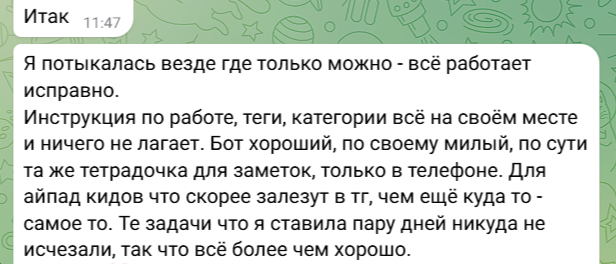

University: [ITMO University](https://itmo.ru/ru/)
Faculty: [FICT](https://fict.itmo.ru)
Course: [Vibe Coding: AI-боты для бизнеса](https://github.com/itmo-ict-faculty/vibe-coding-for-business)
Year: 2025/2026
Group: U4225
Author: Meshcheryakova Tatiana Sergeevna 
Lab: Lab3
Date of create: 31.10.2025
Date of finished: 07.11.2025

# Лабораторная работа №3 — VIBE Coding for Business

## Тема: Разработка и деплой чат-бота с последующим анализом обратной связи

**Цель работы:** Освоить полный цикл разработки: от создания и локального тестирования кода до развертывания чат-бота на облачной платформе, сбора обратной связи от реальных пользователей и внесения улучшений на основе полученных данных.

**Используемые инструменты:** Python, библиотека `python-telegram-bot` (PTB), GitHub, облачная платформа **Railway** (для деплоя), Telegram Bot API.

## 1. Введение

В рамках данной лабораторной работы я реализовала Telegram-бота-планировщика, способного принимать, хранить и отображать задачи. Основная задача заключалась не только в написании функционального кода, но и в успешном развертывании бота в облачной среде для обеспечения его круглосуточной доступности (24/7), а также в цикле итеративного улучшения, основанного на реальном пользовательском фидбеке.

Я выбрала платформу Railway для деплоя, поскольку она была рекомендована как простой и эффективный вариант для Python-приложений, требующих постоянной работы.

## 2. Описание деплоя

### Выбор способа развертывания

Я выбрала **Облачный хостинг** на платформе **Railway** (Вариант 2).

**Аргументы выбора:**
1.  **Постоянный доступ:** Бот должен работать 24/7, что невозможно при локальном запуске с ngrok.
2.  **Автоматизация:** Railway предоставляет автоматический деплой через GitHub и обработку зависимостей, что упрощает процесс.
3.  **Webhook:** Облачный хостинг идеально подходит для реализации механизма Webhook, который является стандартом для Telegram-ботов в продакшене.

### Пошаговый процесс деплоя

#### **Шаг 2: Подготовка к деплою**

1.  **Проверка и адаптация кода:** Я проверила, что бот работает локально (скриншот **97.jpg**), а затем адаптировал его для режима Webhook, используя переменные окружения для токена, URL и порта.
    
2.  **Создание файлов конфигурации:**
    * Я создала файл **`.gitignore`**, чтобы исключить служебные данные (токен, база данных, кэш) из репозитория.
        
    * Создала файл **`requirements.txt`**, перечислив основные зависимости. Важно отметить, что позднее, в процессе отладки, мне пришлось добавить спецификатор `[webhooks]` к `python-telegram-bot`.
        
    * Создал файл **`Procfile`** для Railway, явно указав команду запуска как worker.
        ```
        worker: python bot.py
        ```
        

#### **Шаг 3: Деплой на Railway**

1.  **Импорт проекта:** Я создала новый проект на Railway, подключив его к репозиторию GitHub, что видно на начальных этапах.
    
2.  **Конфигурация окружения:** Я перешела во вкладку **Variables** и установила необходимые переменные: `BOT_TOKEN` и `URL_WEBHOOK`.
    
3.  **Сетевые настройки:** Я настроила порт `8080` (который прослушивает бот) и сгенерировала публичный домен, который стал моим `URL_WEBHOOK`.
    
4.  **Установка Webhook:** Используя сгенерированный URL и мой токен, я отправила запрос к Telegram API для установки Webhook.
    

    **Внесенные изменения (в контексте деплоя):**

| Изменение | Цель | Скриншот |
| :--- | :--- | :--- |
| **Исправление `requirements.txt`** | Обеспечение корректной работы Webhook на Railway. |  |
| **Добавление `runtime.txt`** | Устранение ошибки сборки Python на Railway. | Успешный деплой после исправлений](/lab_3/114.png) |

Я столкнулась с несколькими критическими проблемами, типичными для деплоя Python-приложений в облаке, особенно при переходе на Webhook.
| Проблема | Причина | Решение |
| :--- | :--- | :--- |
| **Ошибка деплоя (Build Error)** | Railway не смог автоматически определить совместимую версию Python (`Error creating build plan`). | Добавление файла **`runtime.txt`** с явным указанием `python-3.11`. |
| **Ошибка зависимости PTB** | При запуске Webhook возникла `RuntimeError`, так как пакет `python-telegram-bot` был установлен без дополнительных компонентов для Webhook. | Исправление `requirements.txt` на **`python-telegram-bot[webhooks]==20.7`** (/lab_3/120.png). |
| **Сбой считывания `BOT_TOKEN`** | Контейнер Railway иногда не передавал переменную `BOT_TOKEN` в процесс, вызывая ошибку `BOT_TOKEN не найден` в логах. | **Временное решение:** Прямая вставка токена в код `bot.py` для обеспечения запуска. **Финальное решение:** Повторная проверка настроек переменных окружения на Railway. |
| **Проблема с публичным URL** | Некорректный URL для Webhook. | Получение корректного публичного URL из настроек Railway и его установка через `setWebhook` (/lab_3/116.png). |


### Проверка работоспособности бота

После устранения всех ошибок деплоя (подробно описано в разделе 7), бот успешно запустился и начал отвечать на команды.
Я провела финальное тестирование, подтвердив его стабильную работу.
Бот доступен по ссылке: [@koshka_vse_uspevaet_bot](https://t.me/koshka_vse_uspevaet_bot)

## 3. Сбор обратной связи (фидбек)

| Категория | Что понравилось | Что вызвало трудности / Предложения по улучшению |
| :--- | :--- | :--- |
| **Функционал** | Базовая функциональность (добавление/список/выполнение) работает стабильно и понятно. | Невозможность фильтровать задачи (например, по тегам). |
| **UX/Интерфейс** | Общая логика бота простая и интуитивная. | Все команды нужно вводить вручную. Нет кнопок для быстрого выполнения задач. |
| **Документация**| Нет ошибок в базовых командах. | Не хватает инструкции по синтаксису (например, как расставлять приоритеты, или как добавлять теги). |

**Скриншоты отзывов пользователей:**
(/lab_3/121.png)
(/lab_3/122.png)
(/lab_3/123.png)
(/lab_3/124.png)
### Определение приоритетов улучшений

На основе фидбека я определила следующий приоритет:
1.  **Высокий:** Улучшение UX — внедрение Inline-клавиатур для выполнения задач (кнопка "Готово").
2.  **Средний:** Расширение функционала — добавление возможности тегирования (`#покупки`) и фильтрации.
3.  **Низкий:** Улучшение документации — доработка команды `/help`.

## 4. Улучшения на основе фидбека
(/lab_3/125.png)
(/lab_3/126.png)
(/lab_3/128.png)
(/lab_3/129.png)

**Подтверждающие скриншоты стабильности и деплоя:**
* Логи, демонстрирующие, что Worker запущен и стабильно принимает соединения:
    

## 5. Выводы

**Что получилось особенно хорошо:**
* Успешный деплой на **Railway** и настройка Webhook, что является более сложным, чем простой polling.
* Системная отладка ошибок сборки и зависимостей, что подтверждает понимание процесса развертывания в облачной среде.
* Получен качественный пользовательский фидбек, который четко указал на необходимость улучшения UX, а не только базового функционала.

**Чему я научился:**
* Я углубила знания в адаптации кода Python для облачных платформ (использование `Procfile`, `runtime.txt`).
* Я освоила принцип работы **Webhook** и методы его установки через API Telegram.
* Я научилась определять приоритеты улучшений на основе реальных данных, а не домыслов.

Этот опыт можно применить в будущих проектах, где требуется масштабируемое и стабильное развертывание сервисов на основе микросервисной архитектуры.
